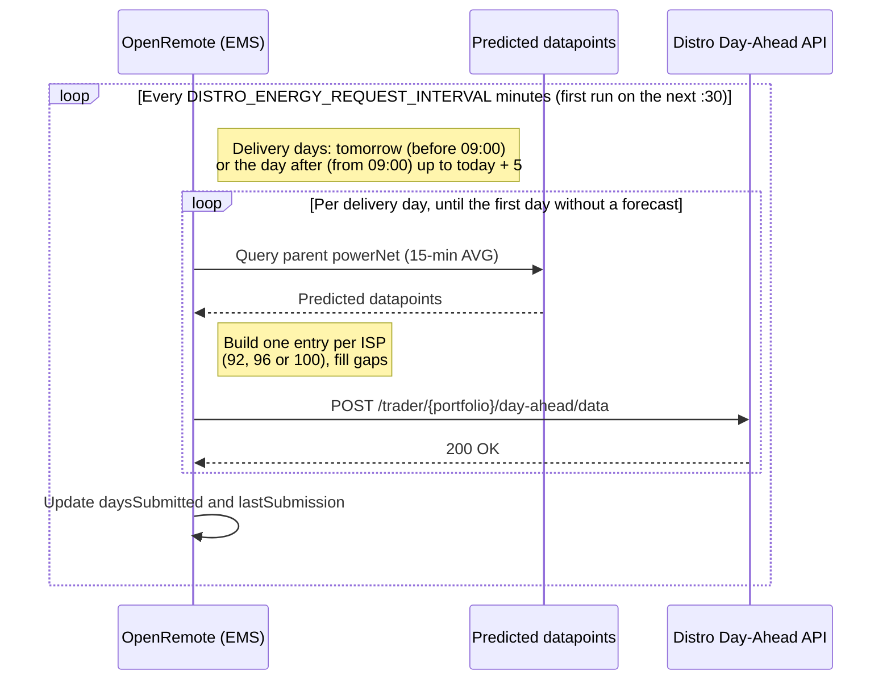

## Distro Energy Integration

### What is Distro Energy?

[Distro Energy](https://developers.distro.energy) trades on the day-ahead electricity market on behalf of its
participants. Within Distro each participant is a **portfolio**. A portfolio submits day-ahead orders (volumes per
15-minute interval, optionally with a price range) and Distro places them on the market.

OpenRemote uses the Distro **Day-Ahead Order Submissions** API to submit the net power forecast of an EMS site as
day-ahead market orders. The API rules that shape the integration:

- Orders may be submitted up to five days in advance
- A new submission replaces any earlier submission for the same delivery day
- For next-day delivery Distro uses the most recent submission received before **09:00 Europe/Amsterdam** on the
  preceding day

### Getting Started

To submit day-ahead orders through OpenRemote, you need the following:

1. **Portfolio identifier** — The participant identifier agreed with Distro. It is a pre-defined prefix, or for
   submissions at individual-meter level the prefix followed by the meter's EAN-18
2. **Client key** — The API key for the Distro API, sent as the `x-client-key` header
3. **Net power forecast** — An `Ems Energy Optimisation Asset` whose `powerNet` attribute has predicted data points
   for the coming days. These predicted values are what gets submitted

#### Configuration

The following environment variables must be set on the OpenRemote manager:

| Variable                         | Required | Description                                                                                                      |
| -------------------------------- | -------- | ---------------------------------------------------------------------------------------------------------------- |
| `DISTRO_ENERGY_CLIENT_KEY`       | Yes      | Client key for the Distro API, sent as the `x-client-key` header. The handler does not start without it.         |
| `DISTRO_ENERGY_BASE_URL`         | No       | Base URL of the Distro API (default: `https://ibt.prod.distro.energy/api/v1`)                                    |
| `DISTRO_ENERGY_TIMEZONE`         | No       | Market time zone, used for delivery days, ISP positions and the 09:00 gate closure (default: `Europe/Amsterdam`) |
| `DISTRO_ENERGY_REQUEST_INTERVAL` | No       | Minutes between submission runs (default: `60`)                                                                  |

#### Asset Setup

In OpenRemote, create an `Ems Distro Energy Asset` as a child of an `Ems Energy Optimisation Asset` and set the
`portfolio` attribute to your Distro portfolio identifier. The parent's `powerNet` forecast is submitted for this
portfolio.

| Attribute        | Value Type       | Read-only | Purpose                                                                                                                     |
| ---------------- | ---------------- | --------- | --------------------------------------------------------------------------------------------------------------------------- |
| `portfolio`      | Text             |           | Distro portfolio identifier. Setting or changing it (re)starts the handler.                                                 |
| `lastSubmission` | Timestamp        | ✓         | When the last run that submitted at least one delivery day finished.                                                        |
| `daysSubmitted`  | Positive integer | ✓         | Number of delivery days submitted by the last run, which in practice is the forecast horizon in days. Written on every run. |

A run that finds no forecast at all sets `daysSubmitted` to `0` and leaves `lastSubmission` untouched, so a stalled
forecast shows up as a fresh `0` next to an old `lastSubmission`.

### Developer Guide

#### Components

```
distroenergy/
  DistroEnergyHandler.java        Schedules the submission runs, reads the powerNet forecast,
                                  builds the payload and posts it per delivery day
  DayAheadResource.java           RESTEasy client proxy for POST /trader/{portfolio}/day-ahead/data
  dto/DayAheadSubmission.java     DTO for one delivery day (data, day, creationTimestamp)
  dto/SubmissionData.java         DTO for one ISP entry (position, priceLow, priceHigh, volume)
```

`EmsOptimisationService` owns the handler lifecycle. It starts a handler at boot for every `Ems Distro Energy Asset`
with a `portfolio`, restarts it when the asset or its `portfolio` changes, and stops it when the asset is deleted.
Handlers are keyed by asset id, so editing the portfolio replaces the handler instead of leaving the old one running.

A handler is not deployed, and a warning is logged, when:

- `portfolio` is blank
- the asset has no parent, or the parent is not an `Ems Energy Optimisation Asset`
- `DISTRO_ENERGY_CLIENT_KEY` is not set, or the client cannot be created

These failures only affect that asset. The rest of the EMS service keeps running.

#### Data Flow



#### Schedule

The first run starts at the next half hour after deploy, then repeats every `DISTRO_ENERGY_REQUEST_INTERVAL` minutes. Each run submits
the delivery days from the first open day up to five days after today, market time:

- Before 09:00 the first open day is tomorrow
- From 09:00 tomorrow is closed, and the first open day is the day after tomorrow

The run stops at the first day without any forecast, since the days after it are beyond the forecast horizon too. There
is no catch-up state: because Distro replaces a day on every submission, the next run simply sends the latest forecast
again. With the default interval the 08:30 run is the last one that reaches tomorrow.

#### Payload

One request is sent per delivery day:

```json
{
  "day": 20260602,
  "creationTimestamp": 1780300800,
  "data": [
    { "position": 1, "volume": -10.5 },
    { "position": 2, "volume": -9.75 }
  ]
}
```

| Field                   | Source                                                                                                                  |
| ----------------------- | ----------------------------------------------------------------------------------------------------------------------- |
| `day`                   | Delivery day in `YYYYMMDD` format, in market time                                                                       |
| `creationTimestamp`     | Current time in Unix seconds                                                                                            |
| `position`              | ISP number within the day, starting at `1` for 00:00–00:15. A day has 96 positions, 92 on the switch to DST, 100 off it |
| `volume`                | Average forecast `powerNet` over the ISP converted to kWh: `-powerNet × 0.25`, rounded to 0.01 kWh                      |
| `priceLow`, `priceHigh` | Not sent, so Distro submits market orders                                                                               |

Distro signs buys negative and sells positive. Positive `powerNet` is import, so a forecast of 42 kW import over an ISP
becomes a volume of `-10.5` kWh.

#### Gap Handling

Distro requires every position of the day to carry a volume, so gaps in the forecast are filled before submitting:

- **No forecast for the whole day** — The day is not submitted. Sending it would post a zero trading position for a day
  without a forecast
- **Gaps inside the forecast** — Submitted as `0.0` and logged as a warning, because `0.0` is a real trading position
- **Gaps after the forecast ends** — Submitted as `0.0` up to midnight, logged at fine level. This is expected when the
  forecast horizon ends partway through a day
- **Repeated hour on the switch off DST** — A forecast producer that writes a fixed 96-slot day has no values for the
  four extra ISPs. They reuse the next forecast value of the day instead of trading the hour away, and a warning is
  logged

#### Resilience

- A failure for one delivery day (HTTP error or exception) is logged as `Failed to submit day-ahead forecast for
portfolio … and day …` and the run continues with the next day. The schedule itself keeps running
- Stopping the handler cancels the schedule, interrupts any request in flight and closes the HTTP client
- Use `daysSubmitted` and `lastSubmission` to spot a stalled integration without reading the logs

### Testing

To test against Distro's development environment, set `DISTRO_ENERGY_BASE_URL` to
`https://ibt.dev.distro.energy/api/v1`. The Distro spec also defines a `GET /healthz` endpoint for checking that the API is reachable.

Automated tests:

- `DistroEnergyHandlerTest` — payload building, volume conversion, DST days and gap filling
- `DistroEnergyHandlerStatusTest` — status attributes written after a run and the gate closure boundary
- `EmsOptimisationServiceDistroEnergyTest` — handler lifecycle in `EmsOptimisationService`
