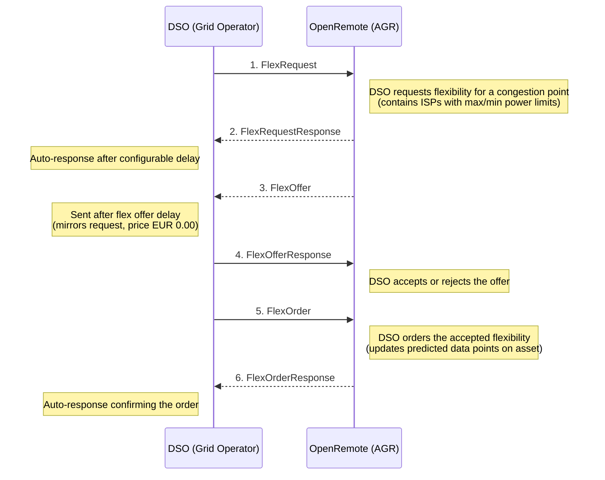
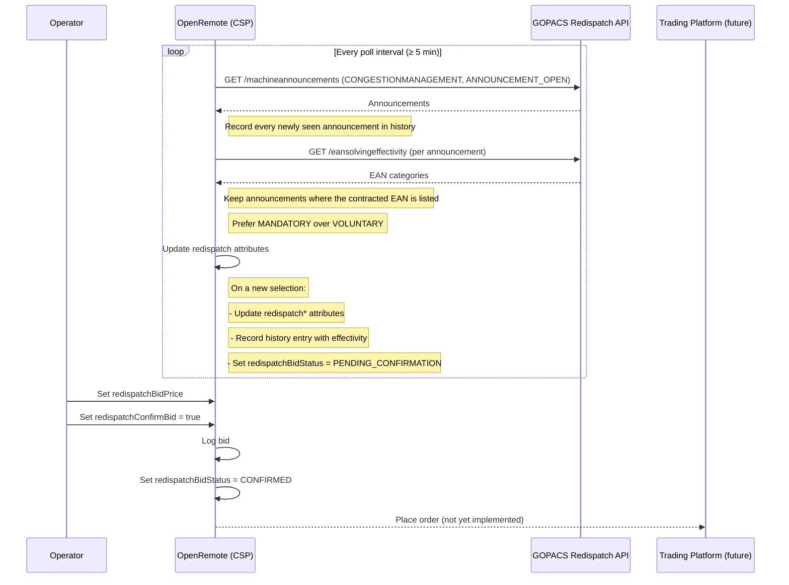

## GOPACS Integration

### What is GOPACS?

[GOPACS](https://www.gopacs.eu/) (Grid Operators Platform for Congestion Solutions) is a platform operated by Dutch grid
operators (DSOs and TSO) to manage electricity grid congestion through market-based electricity flexibility trading.
When the grid is at risk of overloading, GOPACS publishes flexibility requests that can be fulfilled by market
participants, such as Congestion Service Providers (CSPs) and aggregators, who can adjust electricity consumption or
production to help relieve congestion.

Communication between GOPACS and market participants is based on the UFTP (USEF Flexibility Trading Protocol), which
originated from the [USEF](https://www.usef.energy/) (Universal Smart Energy Framework). The protocol is implemented
through the [Shapeshifter](https://github.com/shapeshifter/shapeshifter-library-java) library.

For detailed information, see the [GOPACS documents and manuals](https://www.gopacs.eu/en/documents-and-manuals/).

### Getting Started

To participate in GOPACS flex trading through OpenRemote, you need the following::

1. **GOPACS account** — Register as a Trading Company at [gopacs.eu](https://www.gopacs.eu/)
2. **OAuth2 client credentials** (`client_id` and `client_secret`) —
   See [OAuth2 Client Credentials for API Clients](https://www.gopacs.eu/wp-content/uploads/2025/12/GOPACS-OAuth2-Client-credentials-for-API-Clients-03-12-2025.pdf)
3. **Signing key pair** — An Ed25519 private key file for signing UFTP messages. The corresponding public key must be
   registered with GOPACS
4. **Contracted EAN** — The EAN (European Article Number) identifying your grid connection point, as agreed with your
   DSO

#### Configuration

The following environment variables must be set on the OpenRemote manager:

| Variable                          | Required | Description                                                                                                    |
| --------------------------------- | -------- | -------------------------------------------------------------------------------------------------------------- |
| `GOPACS_PRIVATE_KEY_FILE`         | Yes      | File path to the Ed25519 private key for signing UFTP messages                                                 |
| `GOPACS_CLIENT_ID`                | Yes      | OAuth2 client ID from GOPACS                                                                                   |
| `GOPACS_CLIENT_SECRET`            | Yes      | OAuth2 client secret from GOPACS                                                                               |
| `GOPACS_PARTICIPANT_URL`          | No       | Address book base URL (default: `https://clc-message-broker.gopacs-services.eu`)                               |
| `GOPACS_OAUTH2_URL`               | No       | OAuth2 token endpoint (default: `https://auth.gopacs-services.eu/realms/gopacs/protocol/openid-connect/token`) |
| `GOPACS_RESPONSE_DELAY_SECONDS`   | No       | Delay before auto-responding to messages (default: `10`)                                                       |
| `GOPACS_FLEX_OFFER_DELAY_SECONDS` | No       | Delay before sending a flex offer (default: `30`)                                                              |

#### Asset Setup

In OpenRemote, create an `Ems GOPACS Asset` as a child of an `Ems Energy Optimisation Asset` and set the `contractedEAN`
attribute to your grid connection's EAN.

### Developer Guide

#### Components

```
gopacs/
  GOPACSHandler.java              Core orchestrator — handles all UFTP message processing,
                                  signing, OAuth2 auth, and scheduling
  GOPACSServerResource.java       JAX-RS interface for the inbound endpoint (POST /gopacs/message)
  GOPACSServerResourceImpl.java   Delegates incoming XML to GOPACSHandler::processRawMessage
  GOPACSAuthResource.java         RESTEasy client proxy for OAuth2 token requests
  GOPACSAddressBookResource.java  RESTEasy client proxy for DSO participant lookup
  FlexRequestISPTypeHelper.java   Converts ISP numbers to timestamps (with DST handling)
  OAuth2TokenResponse.java        DTO for OAuth2 token responses
```

#### Data Flow

OpenRemote acts as an **AGR (Aggregator)** in the UFTP protocol. The message exchange with the DSO (Distribution System
Operator) follows this flow:



**How flex orders feed into optimisation:**

1. Flex order power values are written as predicted data points on the `Ems GOPACS Asset` attributes (
   `powerLimitMaximumProfileFlexOrder`, `powerLimitMinimumProfileFlexOrder`)
2. `EmsOptimisationService.updatePowerLimitProfileTotalForecasts()` merges these GOPACS constraints with manual power
   limits from the parent `Ems energy optimisation asset`
3. The combined limits are used by the optimisation methods to constrain energy scheduling

#### Inbound Endpoint

The handler deploys a JAX-RS web application at `/gopacs`. Incoming signed UFTP XML messages are posted to:

```
POST /gopacs/message
Content-Type: application/xml
```

Processing steps:

1. Deserialize signed XML envelope
2. Verify cryptographic signature using the sender's public key (from address book)
3. Deserialize UFTP payload
4. Process business logic (update asset attributes, schedule data points)
5. After a delay, send the auto-response (ensures the HTTP response is returned first)

#### Authentication

- **Inbound messages**: Verified using the DSO's public key, fetched from the GOPACS address book (
  `GET /v2/participants/DSO?contractedEan=<EAN>`) and cached in memory
- **Outbound messages**: Signed with the private key from `GOPACS_PRIVATE_KEY_FILE`, delivered with an OAuth2 Bearer
  token obtained via client credentials flow from the GOPACS Keycloak instance

#### ISP Handling

ISPs (Imbalance Settlement Periods) are 15-minute intervals. `FlexRequestISPTypeHelper` converts ISP numbers to
timestamps and includes special handling for European Daylight Saving Time transitions (CET/CEST) on the last Sundays of
March and October.

## Redispatch (Intraday Congestion Management)

### Overview

In addition to the UFTP day-ahead flex trading described above, GOPACS provides a **Redispatch** mechanism for intraday
congestion management. When a congestion situation is expected during the day, grid operators publish announcements
requesting flexibility from market participants.

> Prerequisites are the same as UFTP — see [Getting Started](#getting-started) for the GOPACS account and contracted
> EAN. Redispatch additionally requires an API key (see [Configuration](#configuration-1) below).

The Redispatch flow is different from the UFTP flow:

1. **Announcements** — GOPACS publishes congestion announcements via a REST API
2. **EAN effectivity** — CSPs check which of their EANs can help solve the congestion
3. **Bidding** — CSPs place buy/sell orders on connected trading platforms (ETPA, EPEX SPOT, NordPool)
4. **Matching** — The GOPACS algorithm matches orders across platforms
5. **Activation** — The trading platform notifies the CSP when an order is filled
6. **Delivery** — The CSP adjusts power as agreed



**Selection rules:** per poll, the handler keeps only `CONGESTIONMANAGEMENT` / `ANNOUNCEMENT_OPEN` announcements where
the contracted EAN appears in some EAN-effectivity category, then prefers `MANDATORY` over `VOLUNTARY` compliance type
when more than one matches.

### Configuration

| Variable                                  | Required | Description                                                                                                                                                |
| ----------------------------------------- | -------- | ---------------------------------------------------------------------------------------------------------------------------------------------------------- |
| `GOPACS_REDISPATCH_API_KEY`               | Yes      | API key from GOPACS UI (User Menu > Settings > Generate API-key); required to resolve EAN effectivity per announcement. Polling will not start without it. |
| `GOPACS_REDISPATCH_URL`                   | No       | Base URL for the Redispatch API (default: `https://idcons.gopacs-services.eu`)                                                                             |
| `GOPACS_REDISPATCH_POLL_INTERVAL_MINUTES` | No       | Polling interval in minutes (default: `5`, minimum: `5`)                                                                                                   |

### Asset attributes

On the `EMS GOPACS Asset` set the **`redispatchEnabled`** to `true` to start polling for announcements. The user can set the `redispatchBidPrice` and `redispatchConfirmBid`. All status, bid-suggestion and history attributes
are read-only.

| Group         | Attribute                       | Value Type  | Units   | Read-only | Purpose                                                                                                                                                                             |
| ------------- | ------------------------------- | ----------- | ------- | --------- | ----------------------------------------------------------------------------------------------------------------------------------------------------------------------------------- |
| Configuration | `redispatchEnabled`             | Boolean     | -       |           | Turn redispatch on/off                                                                                                                                                              |
| Announcement  | `redispatchAnnouncementId`      | Text        | -       | ✓         | ID of the currently selected announcement, if any.                                                                                                                                  |
| Announcement  | `redispatchComplianceType`      | Text        | -       | ✓         | `MANDATORY` or `VOLUNTARY`.                                                                                                                                                         |
| Announcement  | `redispatchAnnouncementMessage` | Text        | -       | ✓         | Free-text description from the DSO.                                                                                                                                                 |
| Announcement  | `redispatchStartTime`           | Timestamp   | -       | ✓         | Start of the problem period.                                                                                                                                                        |
| Announcement  | `redispatchEndTime`             | Timestamp   | -       | ✓         | End of the problem period.                                                                                                                                                          |
| Announcement  | `redispatchBidValidityEnd`      | Timestamp   | -       | ✓         | Latest moment a bid can still be submitted for this announcement.                                                                                                                   |
| Announcement  | `redispatchRequestedPower`      | Number      | kW      | ✓         | Remaining problem profile, written as predicted data points (15-min ISP grid, 7-day retention).                                                                                     |
| Announcement  | `redispatchEanEffectivity`      | Text        | -       | ✓         | Effectivity category in which the contracted EAN was matched (e.g. `THREE_PHASE_NETWORK_REDUCE`).                                                                                   |
| Announcement  | `redispatchRequestAreaBuy`      | Text        | -       | ✓         | DSO-supplied area description for buy orders.                                                                                                                                       |
| Announcement  | `redispatchRequestAreaSell`     | Text        | -       | ✓         | DSO-supplied area description for sell orders.                                                                                                                                      |
| Announcement  | `redispatchLastPoll`            | timestamp   | -       | ✓         | Timestamp of the last completed poll cycle (only updated when the API responded).                                                                                                   |
| Bid           | `redispatchBidPrice`            | Number      | EUR/MWh |           | Operator-supplied bid price.                                                                                                                                                        |
| Bid           | `redispatchSuggestedPower`      | Number      | kW      | ✓         | _Not yet populated — pending bid pricing strategy follow-up._                                                                                                                       |
| Bid           | `redispatchSuggestedVolume`     | Number      | kWh     | ✓         | _Not yet populated — pending bid pricing strategy follow-up._                                                                                                                       |
| Workflow      | `redispatchConfirmBid`          | Boolean     | -       |           | Set to `true` to confirm the active bid. Handler resets it after processing.                                                                                                        |
| Workflow      | `redispatchBidStatus`           | Text        | -       | ✓         | Bid status: <br/>- `NONE` no active announcement<br/>- `PENDING_CONFIRMATION` operator action required<br/> - `CONFIRMED` bid logged (and, in future, sent to the trading platform) |
| History       | `redispatchAnnouncementHistory` | JSON object | -       | ✓         | Last polled announcement, see attribute history for announcement history.                                                                                                           |
| History       | `redispatchBidHistory`          | JSON object | -       | ✓         | Last confirmed bid, see attribute history for confirmed bid history.                                                                                                                |

### Operator Workflow (Pilot Phase)

1. When a relevant congestion announcement is detected, the asset attributes are updated with the announcement details
2. The `redispatchBidStatus` is set to `PENDING_CONFIRMATION`
3. The operator reviews the announcement info and suggested bid values
4. The operator sets `redispatchBidPrice` (EUR/MWh) and toggles `redispatchConfirmBid` to `true`
5. The bid is confirmed and logged (trading platform integration is pending)

### Resilience and polling

- The polling interval is clamped to a minimum of 5 minutes because GOPACS recommends spacing requests at least that far
  apart.
- HTTP errors and exceptions on the announcements endpoint **skip the poll and preserve current attributes**, so
  transient API hiccups do not flap the bid status. Any _successful_ poll (HTTP 200) that yields no announcement
  selected for the contracted EAN clears the active announcement and resets `redispatchBidStatus` to `NONE`. That covers
  three cases: the response is empty, the response has announcements but none are open `CONGESTIONMANAGEMENT`, or some
  are but the contracted EAN is not listed in their EAN-effectivity categories. Only a failed fetch (HTTP error /
  exception) leaves the previous announcement untouched.
- A _persistent_ non-200 (e.g. an invalid API key returning 401, or a sustained outage) keeps the previously selected
  announcement on screen indefinitely. If `redispatchLastPoll` falls behind the configured interval, check the manager
  logs for `Failed to fetch announcements: HTTP …` (warning) or `Error fetching announcements` (severe).
- The handler **refuses to start** (logs `SEVERE`) when `GOPACS_REDISPATCH_API_KEY` is unset — without it there is no
  way to resolve EAN effectivity per announcement.
- Toggling `redispatchEnabled` off then on restarts the handler. The same applies when `contractedEAN` is changed.
  Useful when you need to force a clean state.

### Components

```
gopacs/
  GOPACSRedispatchHandler.java      Polls announcements, checks EAN effectivity, manages bid workflow
  GOPACSAnnouncementResource.java   RESTEasy client proxy for /machineannouncements (public, no auth)
  GOPACSEanEffectivityResource.java RESTEasy client proxy for EAN effectivity (API key auth)
  dto/AnnouncementDto.java          DTO for announcement JSON responses
  dto/TimeSpanDto.java              DTO for time span objects
  dto/EanSolvingEffectivityDto.java DTO for EAN effectivity responses
```

### History

Announcement and bid history are stored as time-series data points on `redispatchAnnouncementHistory` and
`redispatchBidHistory`, retained for 90 days and viewable in the OpenRemote history panel.

`redispatchAnnouncementHistory` records **every** polled announcement on first sight (including ones that the
EAN-effectivity check later rejects), so the audit trail captures everything GOPACS returned during the handler's
lifetime — not just the announcements that became active. When an announcement is then _selected_ on a poll, a second,
richer history entry is recorded with the matched effectivity details, so an active announcement will appear twice in
the timeline (once at first sight, once on selection). To keep memory bounded for long-running handlers, the running set
of already-recorded announcement IDs is capped at 10 000 entries (oldest inserted IDs are evicted first —
insertion-order/FIFO).

### Future

- **Trading platform integration** — When a platform is chosen (ETPA, EPEX SPOT, or NordPool), automated bid placement
  will be added
- **Automatic bidding** — After the pilot phase, the confirmation step will be optional
- **Bid pricing engine** — Dynamic bid pricing incorporating BRP imbalance costs, rebound costs, and opportunity costs

### Testing

GOPACS provides a dedicated testing environment.
See [Testing UFTP API Flex Messages](https://www.gopacs.eu/wp-content/uploads/2025/12/GOPACS-Testing-receiving-and-sending-flex-messages-by-UFTP-testing-functionality-04-12-2025.pdf)
for their guide on sending and receiving flex messages via the UFTP testing functionality.

For additional context on the protocol and contract types,
see [Flex Trading with CSC and ATR (UFTP Messages)](https://www.gopacs.eu/wp-content/uploads/2026/02/GOPACS-Flex-trading-with-Capacity-Limiting-Contracts-using-UFTP-messages-11-02-2026.pdf).

#### Company Setup for Testing

To configure your Trading Company for testing Capacity Steering Contracts,
follow: [Company Settings for CSC Participation](https://www.gopacs.eu/wp-content/uploads/2025/06/GOPACS-Company-settings-for-participating-in-CSC-Capacity-Steering-Contracts.pdf)
