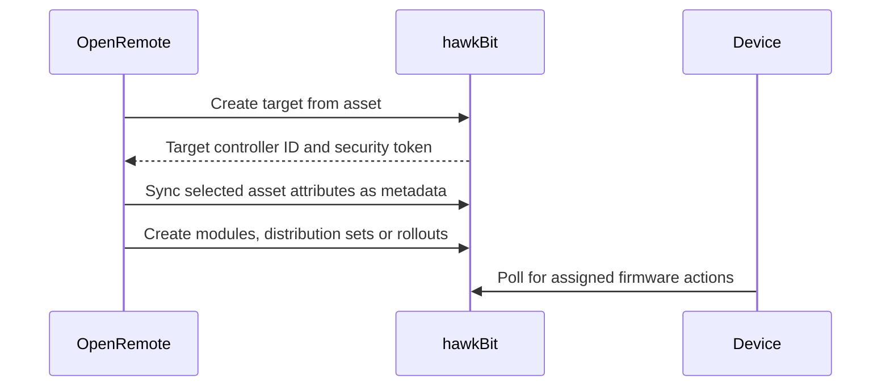

# hawkBit

## Introduction

[hawkBit](https://www.eclipse.org/hawkbit/) is a software update server for connected devices.

This extension connects OpenRemote Manager to the hawkBit Management API, exposes firmware endpoints in OpenRemote, and syncs selected assets as hawkBit targets.

## Prerequisites

You need:

1. A hawkBit instance reachable from OpenRemote Manager
2. Management API credentials for hawkBit
3. An OpenRemote realm that should be synced with hawkBit
4. Assets configured with the firmware meta items described below

## Configuration

The following environment variables can be set on the OpenRemote manager:

| Variable | Required | Description |
|---|---|---|
| `HAWKBIT_MANAGEMENT_API_URL` | No | hawkBit Management API URL (default: `http://localhost:8083/hawkbit/rest/v1`) |
| `HAWKBIT_USERNAME` | No | hawkBit Management API username (default: `hawkbit`) |
| `HAWKBIT_PASSWORD` | No | hawkBit Management API password (default: `hawkbit`) |
| `HAWKBIT_REALM` | No | OpenRemote realm to sync with hawkBit (default: `master`) |

### Docker Compose Example

hawkBit can be started with a separate PostgreSQL database and persistent artifact storage:

```yaml
volumes:
  hawkbitdb-data:
  hawkbit-artifact-data:

services:
  hawkbitdb:
    image: openremote/postgresql:${POSTGRESQL_VERSION:-latest-slim}
    restart: always
    environment:
      POSTGRES_DB: hawkbit
      POSTGRES_USER: ${HAWKBIT_DB_USER:-postgres}
      POSTGRES_PASSWORD: ${HAWKBIT_DB_PASSWORD:-postgres}
    volumes:
      - hawkbitdb-data:/var/lib/postgresql/data

  hawkbit:
    image: openremote/hawkbit-update-server:develop
    restart: always
    depends_on:
      hawkbitdb:
        condition: service_healthy
    healthcheck:
      interval: 3s
      timeout: 3s
      start_period: 3s
      retries: 100
      test: ["CMD", "curl", "--fail", "--silent", "http://localhost:8080/hawkbit"]
    environment:
      - SPRING_DATASOURCE_URL=jdbc:postgresql://hawkbitdb:5432/hawkbit
      - SPRING_DATASOURCE_USERNAME=${HAWKBIT_DB_USER:-postgres}
      - SPRING_DATASOURCE_PASSWORD=${HAWKBIT_DB_PASSWORD:-postgres}
      - SPRING_JPA_DATABASE=POSTGRESQL
      - SPRING_DATASOURCE_DRIVER_CLASS_NAME=org.postgresql.Driver
      - HAWKBIT_DMF_RABBITMQ_ENABLED=false
      - HAWKBIT_ARTIFACT_URL_PROTOCOLS_DOWNLOAD_HTTP_PORT=${HTTPS_FORWARDED_PORT:-443}
      - HAWKBIT_ARTIFACT_URL_PROTOCOLS_DOWNLOAD_HTTP_PROTOCOL=https
      - HAWKBIT_ARTIFACT_URL_PROTOCOLS_DOWNLOAD_HTTP_REF={protocol}://{hostnameRequest}:{port}$${server.servlet.context-path}/{tenant}/controller/v1/{controllerId}/softwaremodules/{softwareModuleId}/artifacts/{artifactFileName}
      - HAWKBIT_SERVER_DDI_SECURITY_AUTHENTICATION_TARGETTOKEN_ENABLED=true
      - SERVER_USE_FORWARD_HEADERS=true
      - SERVER_FORWARD_HEADERS_STRATEGY=NATIVE
      - SERVER_SERVLET_CONTEXT_PATH=/hawkbit
      - HAWKBIT_SECURITY_USER_ADMIN_TENANT=#{null}
      - HAWKBIT_SECURITY_USER_ADMIN_PASSWORD=#{null}
      - HAWKBIT_SECURITY_USER_ADMIN_ROLES=#{null}
      - HAWKBIT_SECURITY_USER_HAWKBIT_TENANT=DEFAULT
      - HAWKBIT_SECURITY_USER_HAWKBIT_PASSWORD={noop}${HAWKBIT_PASSWORD:?HAWKBIT_PASSWORD must be set}
      - HAWKBIT_SECURITY_USER_HAWKBIT_ROLES=TENANT_ADMIN
    volumes:
      - hawkbit-artifact-data:/opt/hawkbit/artifactrepo
    expose:
      - "8080"
```

Set the matching Manager environment variables:

```env
HAWKBIT_MANAGEMENT_API_URL=http://hawkbit:8080/hawkbit/rest/v1
HAWKBIT_PASSWORD=<same value as the hawkBit service>
```

### HAProxy Example

When hawkBit is behind the OpenRemote proxy, only expose the DDI controller API publicly. OpenRemote Manager uses the Management API over the internal Docker network.

Add the hawkBit ACLs in the `https` frontend before the final `use_backend manager_backend` rule:

```haproxy
    # hawkBit DDI API for device polling and artifact downloads
    acl hawkbit_management_api path_beg /hawkbit/rest/
    acl hawkbit_ddi path_reg ^/hawkbit/[^/]+/controller/v1(/|$)

    http-request deny deny_status 404 if hawkbit_management_api
    use_backend hawkbit_backend if hawkbit_ddi
```

Add the hawkBit backend:

```haproxy
backend hawkbit_backend
  server hawkbit "${HAWKBIT_HOST}":"${HAWKBIT_PORT}" resolvers docker_resolver
```

With the Compose example above, set the proxy environment variables:

```env
HAWKBIT_HOST=hawkbit
HAWKBIT_PORT=8080
```

The public DDI URL uses `/hawkbit/{tenant}/controller/v1/...`. The Management API at `/hawkbit/rest/v1/...` stays internal.

## Asset Usage

### Firmware Targets

To sync an OpenRemote asset as a hawkBit target, add the `firmwareTarget` meta item to one attribute of the asset.

When the asset is created or updated in the configured realm, the extension creates a hawkBit target using the OpenRemote asset ID as the hawkBit controller ID. The target info attribute is updated with the `controllerId` and `securityToken` returned by hawkBit.

When the asset is deleted, the matching hawkBit target is deleted.

### Firmware Metadata

To sync an attribute value as hawkBit target metadata, add the `firmwareMetadata` meta item to the attribute.

Metadata values are converted to strings. The OpenRemote attribute name is used as the hawkBit metadata key. Deleting the attribute removes the metadata entry in hawkBit.

The parent asset must also be synced as a firmware target with `firmwareTarget`.

## Firmware API

OpenRemote Manager exposes endpoints that forward to the configured hawkBit instance.

| Resource | Path | Functionality |
|---|---|---|
| Firmware targets | `firmware/target` | List targets, get target details, metadata, assigned and installed distribution sets, actions |
| Software module types | `firmware/softwaremoduletype` | Create, list, get and delete software module types |
| Software modules | `firmware/softwaremodule` | Create, list, get and delete software modules, list and upload artifacts |
| Distribution set types | `firmware/distributionsettype` | Create, list, get and delete distribution set types, list module type assignments |
| Distribution sets | `firmware/distributionset` | Create, list, get, assign to targets and delete distribution sets |
| Target filters | `firmware/targetfilter` | Create, list, get and delete target filters, manage auto assignment |
| Rollouts | `firmware/rollout` | Create, list, get, start, pause and delete rollouts, list rollout groups |

Read endpoints require the OpenRemote read admin role. Write endpoints require the write admin role.

## Data Flow



## Components

```
manager/firmware/
  FirmwareService.java                         Starts the integration, syncs assets and registers API resources
  FirmwareTargetResourceImpl.java             Proxies target and action requests to hawkBit
  FirmwareSoftwareModuleResourceImpl.java     Proxies software module requests and artifact uploads
  FirmwareDistributionSetResourceImpl.java    Proxies distribution set requests and target assignment
  FirmwareRolloutResourceImpl.java            Proxies rollout requests

manager/hawkbit/
  HawkbitTargetsResource.java                 RESTEasy client proxy for hawkBit targets
  HawkbitSoftwareModulesResource.java         RESTEasy client proxy for software modules
  HawkbitDistributionSetsResource.java        RESTEasy client proxy for distribution sets
  HawkbitRolloutsResource.java                RESTEasy client proxy for rollouts
  HawkbitArtifactUploadClient.java            Multipart artifact upload client

model/firmware/
  FirmwareMetaItemType.java                   Defines firmwareTarget and firmwareMetadata meta items
  FirmwareModelProvider.java                  Registers firmware meta items in the OpenRemote model
```
